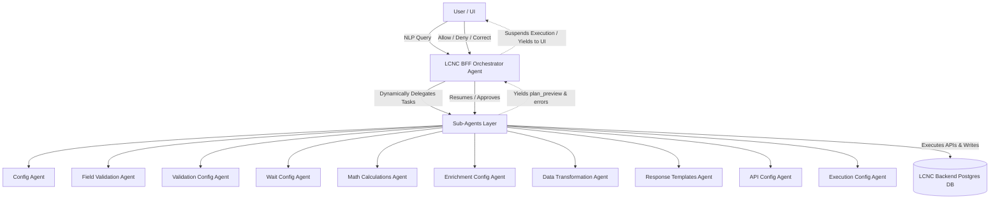
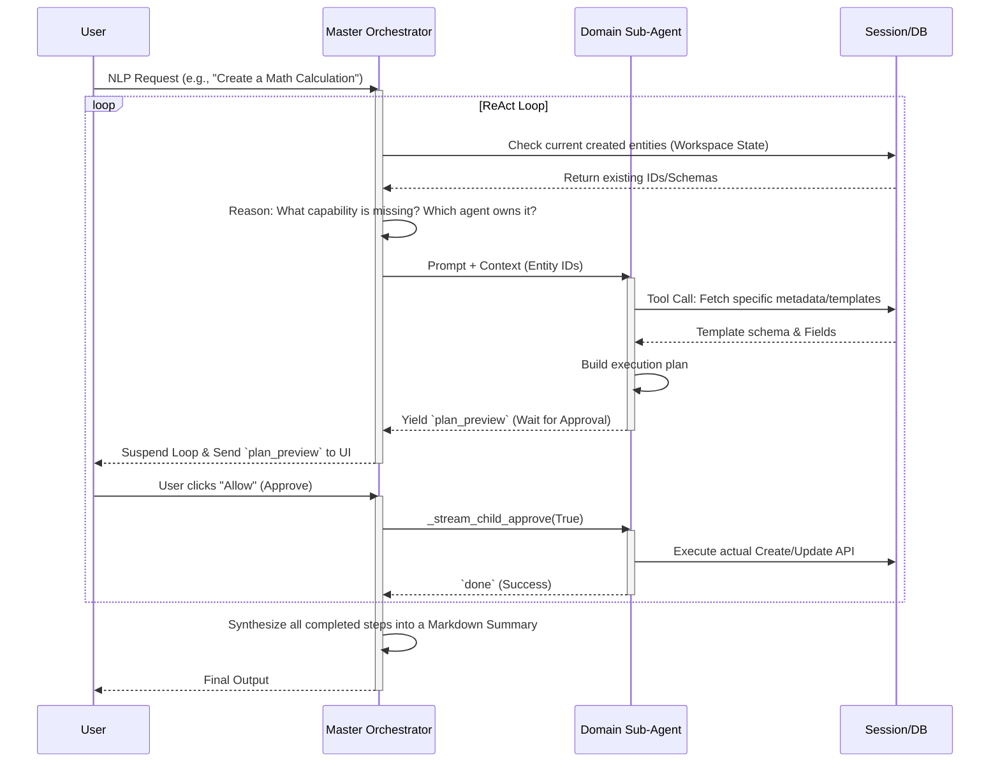

# LCNC BFF AI Agents Architecture Document

This document provides a deep, comprehensive overview of the architectural patterns, relationship topologies, AI stack, and detailed agent capabilities within the LCNC (Low-Code/No-Code) AI Workflow Service.

## 1. System Architecture Diagram

The LCNC BFF Orchestrator serves as the primary entry point (Master Agent) for all natural language instructions from the user. It controls a fleet of 10 specialized domain Sub-Agents.

---

## 2. The ReAct & Human-in-the-Loop (HITL) Flow

The Orchestrator utilizes a combination of **ReAct (Reasoning and Acting)** for planning and a strict **Human-in-the-Loop (HITL)** interception model for safety. 

Because LLMs can hallucinate parameters or target IDs, the system *never* writes blindly to the backend without human approval.

### Key Error Recovery Flow
If a Sub-Agent encounters an error (e.g., *a required field is missing in the DB template*), the Sub-Agent emits an `error` event. The Orchestrator catches this, creates a `"react"` resume state, and yields the error to the User. The user can type a correction, and the Orchestrator will resume the loop gracefully instead of crashing the workflow.

---

## 3. Technology & AI Stack

* **Language & Framework**: Python 3.12+, FastAPI, Uvicorn (for high-performance async streaming).
* **Database & Persistence**: PostgreSQL, SQLAlchemy (asyncpg) providing stateful session storage.
* **Streaming Protocol**: Server-Sent Events (SSE) stream the real-time agent thoughts, plans, validations, and final outputs to the frontend UI.
* **AI Stack**:
  * **LLM Core**: OpenAI API (primarily `gpt-4.1-mini`).
  * **Function Calling**: Direct OpenAI function/tool calling is used by the child agents to interface with backend APIs (`list_api_templates`, `get_template_fields`, etc.).
  * **Prompt Strategy**: System prompts mandate deterministic JSON routing. Hallucinations are actively mitigated using strict pre-validation prompts (e.g., checking if fields exist before writing configurations).

---

## 4. Master Orchestrator Details

### LCNC BFF Orchestrator Agent
The **LCNC BFF Orchestrator** is the central "brain". It never directly manipulates configurations.
* **Role**: Parses ambiguous user intents into a logical dependency sequence.
* **State Management**: Maintains a "Workspace" snapshot of everything created in the current session (e.g., Services, Math Configs, API Configs).
* **Dependency Sequencing**: Understands logical ordering. It knows that core services (`config`) must be built first, followed by middleware (validations, math, transformations), and ultimately chained together into a pipeline (`api_config` and `execution_config`).
* **Synthesis**: Gathers the JSON execution results from all child agents and synthesizes them into a highly readable, structured Markdown response for the user.

---

## 5. Detailed Sub-Agent Capabilities

Each of the 10 Sub-Agents is highly specialized. They have zero memory of previous steps; they rely entirely on the Orchestrator to pass them the necessary IDs and exact context.

### 1. Config Agent
* **Domain**: `config`
* **Role**: The foundational infrastructure layer.
* **Capabilities**:
  * Creates and manages REST API definitions (Services).
  * Manages database connection strings and metadata.
  * Creates raw Database SQL Templates.

### 2. Field Validation Agent
* **Domain**: `field_validation`
* **Role**: Data integrity at the field level.
* **Capabilities**:
  * Configures strict validation rules on incoming or outgoing data.
  * Supports operations like `MINLEN`, `MAXLEN`, `NOT_NULL`, and specific `REGEX` rules.

### 3. Validation Config Agent
* **Domain**: `validation_config`
* **Role**: API/DB response matching and complex conditions.
* **Capabilities**:
  * Configures success or error state routing based on backend responses.
  * Builds conditional logic for pipeline transitions.

### 4. Wait Config Agent
* **Domain**: `wait_config`
* **Role**: Pipeline synchronization.
* **Capabilities**:
  * Configures asynchronous wait durations, delays, and pausing strategies within a pipeline execution.

### 5. Math Calculations Agent
* **Domain**: `math_calculations`
* **Role**: Computation and Data Translation.
* **Capabilities**:
  * **Formulas**: Configures standard operations (`SUM`, `AVERAGE`, `DIVIDE`, `COUNT`, `PERCENTAGE`) and custom grouping/formulas.
  * **Conversions**: Handles explicit conversions like Time (e.g., minutes to hours), Unit (e.g., MB to GB), and Currency (e.g., INR to USD).
  * **Constraint**: Must enforce a strict lookup of the database template schema to verify source fields exist before writing.

### 6. Enrichment Config Agent
* **Domain**: `enrichment_config`
* **Role**: Payload Hydration.
* **Capabilities**:
  * Constructs rules to map database query outputs or secondary API responses to enrich the primary request payload (e.g., looking up a user's address based on an ID).

### 7. Data Transformation Agent
* **Domain**: `data_transformation`
* **Role**: Structure formatting.
* **Capabilities**:
  * Implements field-to-field structural mappings, renaming JSON keys, and formatting nested objects to fit a target schema.

### 8. Response Templates Agent
* **Domain**: `response_template`
* **Role**: Final Presentation structuring.
* **Capabilities**:
  * Configures the exact JSON shape of the final response returned to the caller, dynamically replacing placeholders with computed fields from previous steps.

### 9. API Config Agent
* **Domain**: `api_config`
* **Role**: Pipeline Sequencing.
* **Capabilities**:
  * Glues the components together. It chains the Wait, Math, Validation, and Transformation blocks into a single sequential, executable API pipeline.

### 10. Execution Config Agent
* **Domain**: `execution_config`
* **Role**: Target Execution Mapping.
* **Capabilities**:
  * Defines the actual endpoints/targets, mapping execution payloads to backend services, and configuring the final success/failure indicators.
